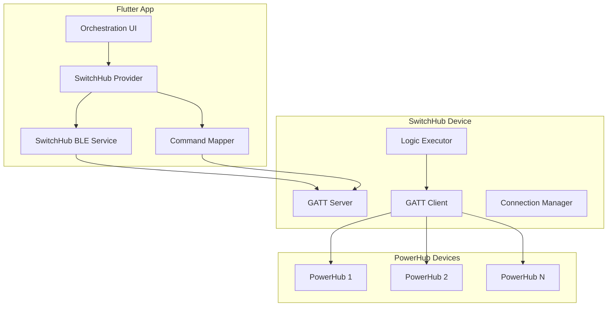

# SwitchHub Flutter App Integration Design

## 1. Overview

This document outlines the design for integrating SwitchHub protocol support into the Flutter PowerHub Manager app, replacing the current local orchestration system with a centralized SwitchHub-based approach.

## 2. Current System Analysis

### 2.1 Current Orchestration Components

The current app implements local orchestration with these key components:

- **OrchestrationProvider**: Manages toggle scenes, command bundles, and execution logic
- **ToggleScene Models**: JSON-based local orchestration data structure
- **BLE Service**: Direct communication with individual PowerHub devices
- **Orchestration Screen**: UI for creating and managing toggle scenes
- **Command Execution**: Direct BLE commands to PowerHub devices

### 2.2 Limitations of Current System

- **Single Device Control**: Can only control one PowerHub at a time
- **Local Logic**: Orchestration runs on the app, requiring app to be active
- **No Centralized Management**: Each device operates independently
- **Limited Scalability**: Cannot coordinate multiple devices simultaneously

## 3. SwitchHub Integration Architecture

### 3.1 High-Level Architecture



### 3.2 Key Design Changes

#### 3.2.1 Device Type Detection
- Extend device scanning to detect both PowerHub and SwitchHub devices
- Use service UUID to differentiate:
  - PowerHub: `119B5F1B-1C7A-3E8E-6147-672F-0100-0B5E`
  - SwitchHub: `119B5F1B-1C7A-3E8E-6147-672F-0200-0B5E`

#### 3.2.2 Dual-Mode Operation
- **PowerHub Mode**: Direct device control (existing functionality)
- **SwitchHub Mode**: Centralized orchestration through SwitchHub
- User can switch between modes in settings

#### 3.2.3 Service Redesign
- **BLE Service**: Extend to support SwitchHub characteristics
- **Orchestration Provider**: Replace with SwitchHub-specific implementation
- **Device Management**: Unified controller for both device types

## 4. Implementation Details

### 4.1 SwitchHub BLE Service Extension

#### 4.1.1 New Service UUIDs
```dart
class SwitchHubBLEService extends BLEService {
  static const String switchHubServiceUuid = '119B5F1B-1C7A-3E8E-6147-672F-0200-0B5E';
  
  // SwitchHub characteristics
  static const String switchHubPowerMgmtUuid = '0000fff1-0000-1000-8000-00805f9b34fb';
  static const String switchHubMonitoringUuid = '0000fff2-0000-1000-8000-00805f9b34fb';
  static const String switchHubOrchestrationUuid = '0000fff3-0000-1000-8000-00805f9b34fb';
}
```

#### 4.1.2 SwitchHub Characteristic Support
- **0xFFF1 (Power Management)**: Voltage thresholds, sleep/wake commands
- **0xFFF2 (Real-time Monitoring)**: Input voltage and status
- **0xFFF3 (Orchestration)**: JSON orchestration data upload/download

#### 4.1.3 JSON Upload/Download Mechanism
```dart
class SwitchHubOrchestrationService {
  Future<void> uploadOrchestrationJson(Map<String, dynamic> jsonData) async {
    // Implement chunked upload with CRC32 verification
    final jsonString = jsonEncode(jsonData);
    final chunks = _splitIntoChunks(jsonString);
    
    for (int i = 0; i < chunks.length; i++) {
      await _writeChunk(i, chunks.length, chunks[i]);
    }
    
    await _verifyAndCommitCrc32(jsonString);
  }
  
  Future<Map<String, dynamic>> downloadOrchestrationJson() async {
    // Read metadata first, then download full JSON
    final metadata = await _readMetadata();
    final fullJson = await _readFullJson(metadata['total_size']);
    return jsonDecode(fullJson);
  }
}
```

### 4.2 SwitchHub Provider Implementation

#### 4.2.1 SwitchHubOrchestrationProvider
```dart
class SwitchHubOrchestrationProvider extends ChangeNotifier {
  SwitchHubOrchestrationProvider({
    required SwitchHubBLEService bleService,
    required StorageService storageService,
  }) : _bleService = bleService,
       _storageService = storageService;
  
  final SwitchHubBLEService _bleService;
  final StorageService _storageService;
  
  SwitchHubConfig? _currentConfig;
  List<SwitchHubDevice> _connectedPowerHubs = [];
  bool _isConnected = false;
  
  // Orchestration management
  Future<void> loadOrchestration() async;
  Future<void> saveOrchestration(Map<String, dynamic> config) async;
  Future<void> executeSwitch(int switchId, String state) async;
  
  // PowerHub device management
  Future<List<String>> scanForPowerHubs() async;
  Future<void> connectToPowerHub(String macAddress) async;
  Future<void> disconnectFromPowerHub(String macAddress) async;
  
  // Status monitoring
  Stream<SwitchHubStatus> get statusStream;
}
```

#### 4.2.2 SwitchHub Data Models
```dart
class SwitchHubConfig {
  final int schemaVersion;
  final List<SwitchHubSwitch> switches;
  final Map<String, dynamic>? metadata;
  
  // Convert to/from SwitchHub JSON format
  factory SwitchHubConfig.fromJson(Map<String, dynamic> json);
  Map<String, dynamic> toJson();
}

class SwitchHubSwitch {
  final int switchId;
  final int revision;
  final SwitchHubLogicNode on;
  final SwitchHubLogicNode off;
  final SwitchHubUIConfig ui;
  
  // Convert to/from SwitchHub switch format
  factory SwitchHubSwitch.fromJson(Map<String, dynamic> json);
  Map<String, dynamic> toJson();
}

class SwitchHubLogicNode {
  final String type; // 'if' or 'leaf'
  final String? condition; // for 'if' nodes
  final SwitchHubLogicNode? then; // for 'if' nodes
  final SwitchHubLogicNode? else; // for 'if' nodes
  final List<SwitchHubSequenceItem>? sequence; // for 'leaf' nodes
}

class SwitchHubSequenceItem {
  final String targetMac;
  final List<PowerHubCommandPacket> commandPackets;
  final int? delayMs;
  final int? retry;
}

class PowerHubCommandPacket {
  final int mode;
  final int channel;
  final String payload; // base64 encoded
  final int? retry;
}
```

### 4.3 UI Adaptation

#### 4.3.1 Device Selection Screen
- Add device type selection (PowerHub vs SwitchHub)
- Show different connection flows based on selection
- Maintain backward compatibility with existing PowerHub devices

#### 4.3.2 Orchestration Screen Updates
- Replace current toggle-based UI with SwitchHub switch model
- Add PowerHub device association management
- Implement IFTTT logic builder for SwitchHub format
- Add UI slot configuration for status display

#### 4.3.3 Status Monitoring
- Display SwitchHub input voltage and status
- Show connected PowerHub devices and their status
- Real-time updates from 0xFFF2 characteristic

### 4.4 Command Mapping

#### 4.4.1 Command Translation
```dart
class SwitchHubCommandMapper {
  static PowerHubCommandPacket mapFromAppCommand(CommandAction action) {
    switch (action.type) {
      case CommandActionType.channelValue:
        return PowerHubCommandPacket(
          mode: 0x00, // Set mode
          channel: action.channel!,
          payload: _encodeValue(action.value!),
        );
      case CommandActionType.fade:
        return PowerHubCommandPacket(
          mode: 0x01, // Fade mode
          channel: action.channel!,
          payload: _encodeFadeParameters(action.targetValue!, action.duration!),
        );
      // Add other command types...
    }
  }
  
  static String _encodeValue(int value) {
    return base64.encode([value & 0xFF]);
  }
  
  static String _encodeFadeParameters(int targetValue, int duration) {
    return base64.encode([
      targetValue & 0xFF,
      (duration >> 8) & 0xFF,
      duration & 0xFF,
    ]);
  }
}
```

## 5. Migration Strategy

### 5.1 Data Migration
- Convert existing ToggleScene data to SwitchHub JSON format
- Map current controller IDs to PowerHub MAC addresses
- Preserve existing command bundles and logic

### 5.2 UI Migration
- Gradual rollout with mode selection
- Provide migration wizard for existing users
- Maintain both systems during transition period

### 5.3 Backward Compatibility
- Keep existing PowerHub functionality intact
- Allow mixed environments (some PowerHub, some SwitchHub)
- Provide clear indicators for device capabilities

## 6. Testing Strategy

### 6.1 Unit Tests
- SwitchHub JSON serialization/deserialization
- Command mapping and encoding
- Orchestration logic parsing

### 6.2 Integration Tests
- SwitchHub connection and communication
- JSON upload/download with CRC verification
- Multi-PowerHub device coordination

### 6.3 UI Tests
- Orchestration screen with SwitchHub devices
- Device management and status monitoring
- Migration workflow testing

## 7. Implementation Phases

### Phase 1: Foundation (Week 1-2)
- [ ] Extend BLE service for SwitchHub support
- [ ] Implement basic SwitchHub connection
- [ ] Create SwitchHub data models

### Phase 2: Core Functionality (Week 3-4)
- [ ] Implement JSON upload/download
- [ ] Create SwitchHub orchestration provider
- [ ] Add basic command execution

### Phase 3: UI Integration (Week 5-6)
- [ ] Update orchestration screen for SwitchHub
- [ ] Add device management UI
- [ ] Implement status monitoring

### Phase 4: Migration & Polish (Week 7-8)
- [ ] Create migration tools
- [ ] Add comprehensive testing
- [ ] Documentation and user guides

## 8. Error Handling & Edge Cases

### 8.1 Connection Issues
- SwitchHub unavailability handling
- PowerHub device connection failures
- Network interruption recovery

### 8.2 Data Integrity
- JSON validation and error recovery
- CRC verification failures
- Partial upload handling

### 8.3 User Experience
- Clear error messages and guidance
- Progress indicators for long operations
- Offline mode capabilities

## 9. Performance Considerations

### 9.1 Memory Management
- Efficient JSON parsing for large orchestration files
- Connection pooling for multiple PowerHub devices
- Background task management

### 9.2 Responsiveness
- Asynchronous operations for all BLE communications
- UI updates on main thread only
- Progress feedback for long-running operations

## 10. Security Considerations

### 10.1 Data Protection
- Secure storage of orchestration data
- Encrypted communication where possible
- Access control for device management

### 10.2 Device Authentication
- MAC address validation
- Device capability verification
- Unauthorized access prevention

This design provides a comprehensive approach to integrating SwitchHub support while maintaining backward compatibility and providing a smooth migration path for existing users.